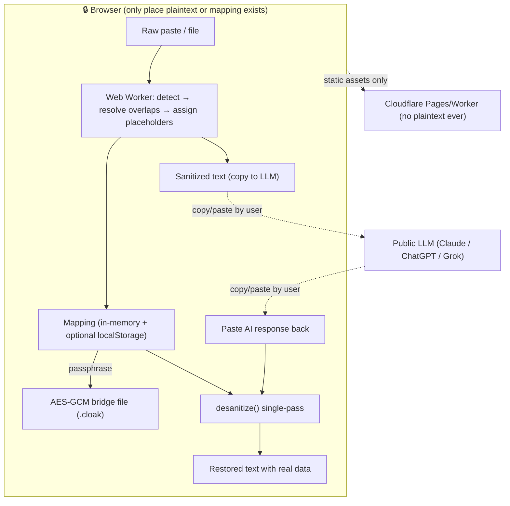

# Cloakroom

[](https://github.com/imcmurray/cloakroom/actions/workflows/ci.yml)
[](https://github.com/imcmurray/cloakroom/actions/workflows/deploy-pages.yml)
[](./LICENSE)

**▶ Live demo: https://imcmurray.github.io/cloakroom/** — runs entirely in your browser; nothing you paste is sent anywhere.

> **Check your secrets at the door. Get them back on the way out.**
> A zero-knowledge, client-side bridge that strips PII/secrets out of text before you paste it into any LLM — then restores your real data into the AI's reply.

The name maps onto the round trip: like a coat check, you hand your secrets over on the way in and collect them on the way out — short, brandable, and non-scary.

**Elevator pitch:** Developers, sysadmins, lawyers, and support staff constantly paste logs, tickets, and documents into ChatGPT/Claude/Grok — leaking IPs, API keys, client names, SSNs, and internal paths. Cloakroom runs entirely in your browser: it detects sensitive values, swaps them for realistic decoys drawn from *reserved* ranges (RFC 5737 IPs, `example.com`, area-900 SSNs, Luhn-valid test cards), keeps a private mapping that never touches a server, and reverses the swap on the AI's response. The LLM gets coherent, useful text; your real data never leaves the machine.

---

## Why "realistic decoys from reserved ranges" is the core trick

Two naive approaches both fail:

- **Opaque tokens** (`[REDACTED_1]`) degrade the LLM's output — it can't reason about "an IP" if it's a meaningless blob, and models sometimes drop or reformat odd tokens.
- **Random realistic fakes** read well to the LLM but risk *colliding with real data* and are indistinguishable from genuine values if the mapping leaks.

Cloakroom uses **format-preserving fakes from documentation/test ranges**: a fake IP is always in `192.0.2.0/24` (RFC 5737, reserved for docs), a fake email ends in `example.com` (RFC 2606), a fake SSN uses area `900–999` (never issued), a fake card uses the `4000…` test BIN with a valid Luhn digit. The output is realistic enough for the model to reason about *and* provably not a real-world value. Both modes ship; `realistic` is the default, `token` is available when perfect reversibility matters more than LLM quality.

---

## Architecture

Everything that touches plaintext is client-side. The optional backend is a dumb static host plus (optionally) a Cloudflare Worker that only ever serves assets and an audit *count* — never plaintext, never the mapping.



**Client responsibilities:** detection, replacement, mapping storage, encryption, reversal, all UI.
**Server responsibilities (optional):** serve the static SPA; that's it. A Worker may store *anonymous aggregate counts* for telemetry, gated behind explicit opt-in. The threat model assumes the server is hostile.

See [`docs/THREAT-MODEL.md`](docs/THREAT-MODEL.md) for the full analysis.

---

## Key algorithms

1. **Detection** (`detectors.ts`): a confidence-ranked detector set (regex + validators like Luhn for cards, area-rules for SSNs) plus user-declared literal terms (names/orgs/codenames) at confidence `1.0`. Overlapping matches are resolved by greedy interval selection: highest confidence → longest span → earliest start.
2. **Consistent replacement** (`engine.ts`): a `type+value → placeholder` cache guarantees the same original always yields the same decoy (relationships preserved); a deterministic seeded PRNG makes fakes reproducible; a uniqueness check prevents two different originals from colliding on one decoy. Replacements are spliced **right-to-left** so string indices never shift.
3. **Reversal** (`engine.ts`): a **single-pass** regex alternation of all placeholders, sorted longest-first, so a restored value that happens to contain another placeholder string is never re-substituted (the classic cascade bug).
4. **Bridge file** (`crypto.ts`): mapping → PBKDF2-SHA256 (600k iters) → AES-256-GCM. Wrong passphrase fails the GCM auth tag (tamper-evident).

---

## MVP scope & roadmap

**MVP (Phase 1):** paste-in/paste-out UI, the built-in detector set, realistic + token modes, manual add/whitelist, in-memory + localStorage mapping, copy buttons, audit panel, dark mode. Pure static site, no backend.

**Phase 2:** encrypted `.cloak` bridge files (import/export), session history (local), file upload (txt/md/json/yaml/csv/logs), per-type toggles, custom replacement rules, reverse-gap warnings ("the AI dropped 2 of your placeholders").

**Phase 3:** transformers.js NER for names/orgs (opt-in model download), PWA/offline, browser extension (auto-sanitize in ChatGPT/Claude textareas), batch mode, structure-aware JSON/YAML handling.

**Phase 4:** self-host bundle, team rule-sets (shared dictionaries, no shared data), CLI (`cloak < input.log`), optional privacy-hardened Worker for org telemetry counts.

---

## Monetization & open-source strategy

Open-core. The engine + SPA are MIT and self-hostable (trust requires auditability for a privacy tool). Revenue from a **Pro/Team** tier: encrypted cross-device sync of *rule-sets only* (never mappings), shared org dictionaries, the browser extension, SSO, and a supported self-host distribution. Lawyers/enterprises pay for support, an audit trail, and a signed reproducible build — not for the core function.

---

## Layout

```
cloakroom/
├── src/core/            # framework-agnostic engine (this scaffold — tested, runnable)
│   ├── types.ts         # shared data types
│   ├── detectors.ts     # regex+validator detectors, overlap resolution
│   ├── generators.ts    # reserved-range, format-preserving fakes
│   ├── engine.ts        # sanitize() / desanitize() / reverseGaps()
│   ├── crypto.ts        # Web Crypto bridge-file encrypt/decrypt
│   ├── engine.test.ts   # round-trip + crypto tests (7 passing)
│   └── index.ts
├── docs/THREAT-MODEL.md
└── (Phase 1) src/ui/    # React + TS + Tailwind SPA, runs core in a Web Worker
```

## Run it

```bash
npm install
npm test        # 7 passing: round-trip, consistency, whitelist, Luhn, crypto
```
