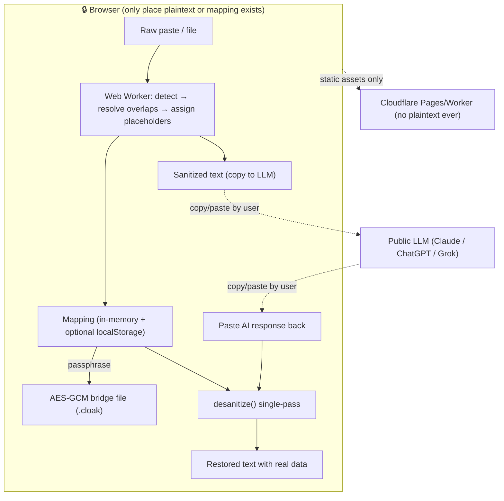

# Cloakroom

[](https://github.com/imcmurray/cloakroom/actions/workflows/ci.yml)
[](https://github.com/imcmurray/cloakroom/actions/workflows/deploy-pages.yml)
[](./LICENSE)

**▶ Live demo: https://imcmurray.github.io/cloakroom/** — runs entirely in your browser; nothing you paste is sent anywhere.

> **Check your secrets at the door. Get them back on the way out.**
> A zero-knowledge, client-side bridge that strips PII/secrets out of text before you paste it into any LLM — then restores your real data into the AI's reply.

The name maps onto the round trip: like a coat check, you hand your secrets over on the way in and collect them on the way out — short, brandable, and non-scary.


**Elevator pitch:** Developers, sysadmins, lawyers, and support staff constantly paste logs, tickets, and documents into ChatGPT/Claude/Grok — leaking IPs, API keys, client names, SSNs, and internal paths. Cloakroom runs entirely in your browser: it detects sensitive values, swaps them for realistic decoys drawn from *reserved* ranges (RFC 5737 IPs, `example.com`, area-900 SSNs, Luhn-valid test cards), keeps a private mapping that never touches a server, and reverses the swap on the AI's response. The LLM gets coherent, useful text; your real data never leaves the machine.

The same engine ships as a zero-dependency **CLI** (`cloak wrap -- claude -p "…"` runs any command over decoys), a **pre-commit gate**, and **Claude Code hooks** that keep secrets out of an agent's context — see below.

---

## Why "realistic decoys from reserved ranges" is the core trick

Two naive approaches both fail:

- **Opaque tokens** (`[REDACTED_1]`) degrade the LLM's output — it can't reason about "an IP" if it's a meaningless blob, and models sometimes drop or reformat odd tokens.
- **Random realistic fakes** read well to the LLM but risk *colliding with real data* and are indistinguishable from genuine values if the mapping leaks.

Cloakroom uses **format-preserving fakes from documentation/test ranges**: a fake IP is always in `192.0.2.0/24` (RFC 5737, reserved for docs), a fake email ends in `example.com` (RFC 2606), a fake SSN uses area `900–999` (never issued), a fake card uses the `4000…` test BIN with a valid Luhn digit. The output is realistic enough for the model to reason about *and* provably not a real-world value. Both modes ship; `realistic` is the default, `token` is available when perfect reversibility matters more than LLM quality.

---

## Architecture

Everything that touches plaintext is client-side. The optional backend is a dumb static host plus (optionally) a Cloudflare Worker that only ever serves assets and an audit *count* — never plaintext, never the mapping.



**Client responsibilities:** detection, replacement, mapping storage, encryption, reversal, all UI.
**Server responsibilities (optional):** serve the static SPA; that's it. A Worker may store *anonymous aggregate counts* for telemetry, gated behind explicit opt-in. The threat model assumes the server is hostile.

See [`docs/THREAT-MODEL.md`](docs/THREAT-MODEL.md) for the full analysis.

---

## Verify "nothing is sent" — don't take our word for it

Privacy claims should be checkable, not trusted. In rough order of how convincing each is:

1. **Pull the plug.** Go offline (or DevTools → Network → *Offline*) and use it. Sanitize, encrypt a bridge file, restore — all work with zero connectivity. Software that works fully offline cannot be exfiltrating your data.
2. **Watch the network.** Open DevTools → Network and run a full sanitize → restore. After the initial page/asset load there are **no** requests — no fetch, XHR, WebSocket, or beacon.
3. **The browser enforces it.** The production build ships a Content-Security-Policy of `connect-src 'none'`, so the browser itself blocks every outbound request. Even injected or compromised code physically cannot phone home.
4. **Read the source.** `grep -rn "fetch\|XMLHttpRequest\|WebSocket\|sendBeacon" src/` returns exactly one hit: the in-app **egress probe**, a fetch that exists to *fail* — it fires at a dummy URL so the UI can show you the CSP blocking it live. Nothing else in `src/` (engine, CLI, hooks included) touches the network. Crypto is Web Crypto (local); detection runs in a Web Worker. It's MIT — build it yourself.
5. **Prove the served bundle is the source (build provenance).** Every deployed file carries a signed [SLSA build-provenance attestation](https://github.com/imcmurray/cloakroom/attestations) tying it to the exact commit and CI workflow. Download an asset and verify it was built from this repo, not tampered with in transit or at the host:
   ```bash
   gh attestation verify <downloaded-asset.js> --repo imcmurray/cloakroom
   ```
6. **Maximum assurance.** A hosted page still asks you to trust the host to serve the real JS on first load — physics, not a bug, for any web app. Self-host the static build, run it offline, or use a pinned browser extension to remove that last sliver of trust.

---

## Key algorithms

1. **Detection** (`detectors.ts`): a confidence-ranked detector set (regex + validators like Luhn for cards, area-rules for SSNs) plus user-declared literal terms (names/orgs/codenames) at confidence `1.0`. Overlapping matches are resolved by greedy interval selection: highest confidence → longest span → earliest start.
2. **Consistent replacement** (`engine.ts`): a `type+value → placeholder` cache guarantees the same original always yields the same decoy (relationships preserved); a deterministic seeded PRNG makes fakes reproducible; a uniqueness check prevents two different originals from colliding on one decoy. Replacements are spliced **right-to-left** so string indices never shift.
3. **Reversal** (`engine.ts`): a **single-pass** regex alternation of all placeholders, sorted longest-first, so a restored value that happens to contain another placeholder string is never re-substituted (the classic cascade bug).
4. **Bridge file** (`crypto.ts`): mapping → PBKDF2-SHA256 (600k iters) → AES-256-GCM. Wrong passphrase fails the GCM auth tag (tamper-evident).

---

## MVP scope & roadmap

**MVP (Phase 1):** paste-in/paste-out UI, the built-in detector set, realistic + token modes, manual add/whitelist, in-memory + localStorage mapping, copy buttons, audit panel, dark mode. Pure static site, no backend.

**Phase 2:** encrypted `.cloak` bridge files (import/export), session history (local), file upload (txt/md/json/yaml/csv/logs), per-type toggles, custom replacement rules, reverse-gap warnings ("the AI dropped 2 of your placeholders").

**Phase 3:** transformers.js NER for names/orgs (opt-in model download), PWA/offline, browser extension (auto-sanitize in ChatGPT/Claude textareas), batch mode, structure-aware JSON/YAML handling.

**Phase 4:** self-host bundle, ✅ team rule-sets (term packs — shared dictionaries, no shared data), ✅ CLI (`cloak`, incl. `wrap` + pre-commit gate), ✅ Claude Code hooks (guard + transparent sanitize/restore), optional privacy-hardened Worker for org telemetry counts. An MCP server was considered and **deliberately deferred**: a model-invoked tool can't protect data from the model that invokes it — see [`docs/CLAUDE-CODE.md`](docs/CLAUDE-CODE.md).

---

## Open source

MIT-licensed and fully self-hostable. For a privacy tool, auditability *is* the trust story — the engine and SPA are open so anyone can verify nothing leaves the browser.

---

## Layout

```
cloakroom/
├── src/core/                  # framework-agnostic engine — one source of truth for
│   ├── detectors.ts           #   every surface (browser, CLI, hooks)
│   ├── generators.ts          # reserved-range fakes + isLikelyDecoy()
│   ├── engine.ts              # sanitize() / desanitize() / reverseGaps()
│   ├── crypto.ts              # bridge encrypt/decrypt (+ key-based variants)
│   └── types.ts, index.ts, engine.test.ts
├── src/ui/                    # React SPA (the live demo); runs core in a Web Worker
├── src/cli/                   # `cloak`: sanitize/restore/wrap/scan/inspect/hook,
│                              #   term packs, session key cache, tests
├── integrations/
│   ├── claude-code/           # guard + transparent hook profiles, /cloak-sanitize
│   └── packs/                 # example term pack (fictional names)
├── .pre-commit-hooks.yaml     # `cloak-scan` for the pre-commit framework
├── scripts/build-cli.mjs      # esbuild → dist-cli/cloak.mjs (single file, Node 20+)
└── docs/                      # THREAT-MODEL, CLI-EXAMPLE, CLAUDE-CODE
```

## Run it

```bash
npm install     # installs deps and builds the CLI (dist-cli/cloak.mjs) via `prepare`
npm test        # engine round-trip/crypto, CLI args, hooks, wrap, packs, source hygiene
```

See [`CONTRIBUTING.md`](CONTRIBUTING.md) for the dev loop and project conventions.

## Command line (`cloak`)

The same engine the browser uses, in your terminal — for logs, CI guardrails, and
piping into any LLM CLI. Zero runtime dependencies; the mapping is only ever
persisted as an AES-256-GCM encrypted **bridge file** (`.cloak`).

```bash
npm run build:cli          # bundles src/cli → dist-cli/cloak.mjs (single file, Node 20+)
npm link                   # optional: put `cloak` on your PATH
```

```bash
# Zero-setup round trip: run ANY command inside the cloak. stdin and args are
# sanitized on the way in, stdout restored on the way out; the mapping lives
# and dies in memory — no bridge file, no passphrase.
cat incident.log | cloak wrap -- claude -p "diagnose this failure"
cat ticket.txt   | cloak wrap -- llm "summarize the customer issue"

# Manual round trip via an encrypted bridge (for paste-into-a-browser flows).
cat incident.log | cloak sanitize --bridge case.cloak | pbcopy   # paste into any LLM
pbpaste          | cloak restore  --bridge case.cloak            # real data back

# Detect-only guardrail: exits 3 if any secret is present (pre-commit / CI).
cloak scan app.log deploy.env || echo "secrets found — blocking"

# Masked audit of an existing bridge (never prints originals in full).
cloak inspect --bridge case.cloak
```

Sanitized text goes to **stdout**; the masked audit and warnings go to **stderr**,
so pipelines only ever carry decoys. The passphrase is read from `$CLOAK_PASS`
(non-interactive pipelines) or prompted hidden on the TTY — never passed as a
flag, so it stays out of shell history and `ps`. Commands: `sanitize`, `restore`,
`wrap`, `scan`, `inspect`, `hook`; run `cloak help` for all options. See `src/cli/`.

### Term packs — team dictionaries

A term pack is a JSON file declaring your org's sensitive literals (people, org
names, codenames → always replaced) and known-safe ones (public hostnames → never
replaced). One maintained dictionary instead of per-user `--custom` flags:

```bash
cloak sanitize app.log --pack moss-terms.json --bridge s.cloak
export CLOAK_PACKS=/etc/cloak/moss-terms.json   # applies everywhere: CLI, wrap, hooks
```

See [`integrations/packs/example-courthouse.json`](integrations/packs/example-courthouse.json)
for the format. Fair warning, stated plainly: a real pack is itself a list of the
names you protect — keep it on an internal share or private repo. If a configured
pack can't be read, commands error and hooks fail closed; terms are never silently
skipped.

### Pre-commit gate

Block commits containing PII/secrets with one stanza in a repo's
`.pre-commit-config.yaml` (uses the [pre-commit](https://pre-commit.com) framework):

```yaml
repos:
  - repo: https://github.com/imcmurray/cloakroom
    rev: v0.2.0
    hooks:
      - id: cloak-scan
```

The masked audit on stderr shows what was caught; originals are never printed.

For a full worked round trip on a realistic incident log — sanitize → LLM → restore,
plus the pre-commit guardrail — see [`docs/CLI-EXAMPLE.md`](docs/CLI-EXAMPLE.md).

## Inside Claude Code

The same CLI wires into Claude Code via hooks so real secrets never enter the model's
context: a **guard** hook that blocks reading secret-laden files, and a **transparent**
mode (`PostToolUse` sanitizes tool output into decoys before the model sees it;
`PreToolUse` restores real values before a `Write` hits disk). Because a tool the model
*calls* is always too late to protect data from the model, the interception has to
happen at the hook boundary. The `cloak hook <guard|sanitize|restore>` subcommand is
the adapter; ready-to-use config is in
[`integrations/claude-code/`](integrations/claude-code/), and the full rationale and
trade-offs are in [`docs/CLAUDE-CODE.md`](docs/CLAUDE-CODE.md).
