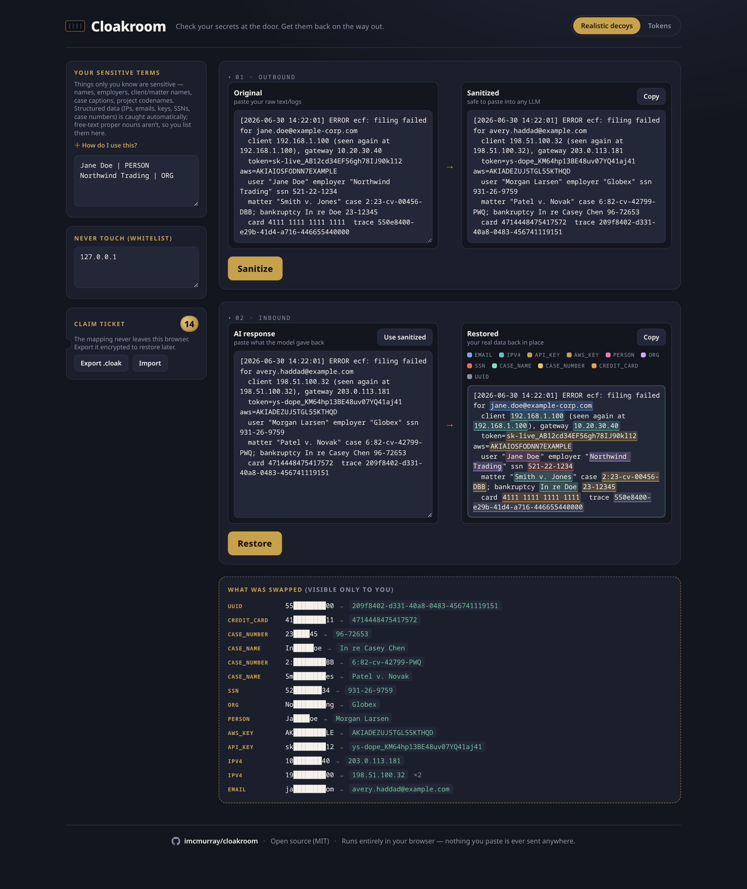

# Cloakroom

[](https://github.com/imcmurray/cloakroom/actions/workflows/ci.yml)
[](https://github.com/imcmurray/cloakroom/actions/workflows/deploy-pages.yml)
[](./LICENSE)

> **Check your secrets at the door. Get them back on the way out.**
> Cloakroom strips PII and secrets out of text before it reaches any LLM — swapping them
> for realistic decoys the model can actually reason about — then restores your real data
> into the reply. The mapping never leaves your machine.

Developers, sysadmins, lawyers, and support staff paste logs, tickets, and documents into
ChatGPT/Claude/Grok every day — leaking IPs, API keys, client names, SSNs, and internal
paths. Cloakroom is the coat check between you and the model:

<p align="center">
  <a href="#four-ways-to-use-it"></a>
  <br>
  <sub>one engine, four doors — take one:</sub>
  <br>
  <a href="#1--in-the-browser--zero-install"></a>
  <a href="#2--on-the-command-line--cloak-wrap"></a>
  <a href="#3--as-a-pre-commit-gate--keep-secrets-out-of-git-history"></a>
  <a href="#4--inside-claude-code--hooks-not-tools"></a>
</p>

The LLM gets coherent, useful text it can work with; your real data never crosses the
line. The threat model assumes everything past the boundary — including the host serving
this very app — is hostile: [`docs/THREAT-MODEL.md`](docs/THREAT-MODEL.md).

---

## Four ways to use it

### 1 · In the browser — zero install

**▶ Live demo: https://imcmurray.github.io/cloakroom/** — paste text, copy the decoyed
version into any LLM, paste the reply back, and collect your real data. Every decoy is
tinted by type so leftovers stand out; **select anything the detectors missed to cloak
it everywhere, click any decoy to un-cloak a false positive** — each refinement re-runs
the engine so the mapping stays complete and reversible. Work several documents at once
in tabs, each with its own independent mapping. Runs entirely client-side (works fully
offline as a PWA); nothing you paste is sent anywhere.



### 2 · On the command line — `cloak wrap`

Run **any** command inside the cloak: stdin and arguments are sanitized on the way in,
stdout is restored on the way out. The mapping lives and dies in process memory — no
setup, no bridge file, no passphrase.



```bash
cat incident.log | cloak wrap -- claude -p "diagnose this failure"
cat ticket.txt   | cloak wrap -- llm "summarize the customer issue"
```

For browser-tab LLMs, the same round trip via an encrypted bridge file:

```bash
cat incident.log | cloak sanitize --bridge case.cloak | pbcopy   # paste into any LLM
pbpaste          | cloak restore  --bridge case.cloak            # real data back
```

Sanitized text goes to **stdout**; the masked audit goes to **stderr**, so pipelines only
ever carry decoys. The bridge passphrase comes from `$CLOAK_PASS` or a hidden TTY prompt —
never a flag, so it stays out of shell history and `ps`. Zero runtime dependencies.
Commands: `sanitize`, `restore`, `wrap`, `scan`, `inspect`, `hook` — `cloak help` for all
options, [`docs/CLI-EXAMPLE.md`](docs/CLI-EXAMPLE.md) for a full worked example.

### 3 · As a pre-commit gate — keep secrets out of git history



One stanza in a repo's `.pre-commit-config.yaml`
([pre-commit](https://pre-commit.com) framework); `cloak scan` exits 3 on any hit and the
masked audit shows what was caught without ever printing an original:

```yaml
repos:
  - repo: https://github.com/imcmurray/cloakroom
    rev: v0.2.0
    hooks:
      - id: cloak-scan
```

### 4 · Inside Claude Code — hooks, not tools

Keep real secrets out of an agent's context entirely. A **guard** profile blocks reading
secret-laden files and withholds shell output that carries secrets; a **transparent**
profile sanitizes everything the model reads into decoys and restores real values before
writes hit disk — the agent does its whole job without ever seeing a real secret.

Why hooks instead of an MCP tool: anything the model *invokes* runs after the model
already has the text, so a model-invoked sanitizer can never protect data from the model
itself. Interception has to happen at the tool boundary. Ready-to-use profiles live in
[`integrations/claude-code/`](integrations/claude-code/); the full rationale and
trade-offs are in [`docs/CLAUDE-CODE.md`](docs/CLAUDE-CODE.md).

### For teams — term packs

A term pack is a JSON dictionary of your org's sensitive literals (people, org names,
codenames → always replaced) and known-safe ones (public hostnames → never replaced),
honored by the CLI, `wrap`, and the hooks alike:

```bash
cloak sanitize app.log --pack org-terms.json --bridge s.cloak
export CLOAK_PACKS=/etc/cloak/org-terms.json    # applies everywhere
```

Format: [`integrations/packs/example-courthouse.json`](integrations/packs/example-courthouse.json).
Stated plainly: a real pack is itself a list of the names you protect — keep it on an
internal share, never in a public repo. If a configured pack can't be read, commands
error and hooks fail closed; terms are never silently skipped.

---

## Why realistic decoys from *reserved* ranges

Two naive approaches both fail: **opaque tokens** (`[REDACTED_1]`) degrade the LLM's
output — it can't reason about "an IP" that's a meaningless blob, and models drop or
reformat odd tokens; **random realistic fakes** read well but risk colliding with real
data and are indistinguishable from genuine values if the mapping leaks.

Cloakroom's decoys are **format-preserving fakes from documentation/test ranges**: a fake
IP is always in `192.0.2.0/24` (RFC 5737, reserved for docs), a fake email ends in
`example.com` (RFC 2606), a fake SSN uses area `900–999` (never issued), a fake card uses
a test BIN with a valid Luhn digit. Realistic enough for the model to reason about, *and*
provably not a real-world value — which also means scanners (including Cloakroom's own
guards) can recognize sanitized text and never re-flag it. A `token` mode ships for when
perfect reversibility matters more than LLM quality.

---

## Verify "nothing is sent" — don't take our word for it

Privacy claims should be checkable, not trusted. In rough order of how convincing each is:

1. **Pull the plug.** Go offline (or DevTools → Network → *Offline*) and use it. Sanitize, encrypt a bridge file, restore — all work with zero connectivity. Software that works fully offline cannot be exfiltrating your data.
2. **Watch the network.** Open DevTools → Network and run a full sanitize → restore. After the initial page/asset load there are **no** requests — no fetch, XHR, WebSocket, or beacon.
3. **The browser enforces it.** The production build ships a Content-Security-Policy of `connect-src 'none'`, so the browser itself blocks every outbound request. Even injected or compromised code physically cannot phone home.
4. **Read the source.** `grep -rn "fetch\|XMLHttpRequest\|WebSocket\|sendBeacon" src/` returns exactly one hit: the in-app **egress probe**, a fetch that exists to *fail* — it fires at a dummy URL so the UI can show you the CSP blocking it live. Nothing else in `src/` (engine, CLI, hooks included) touches the network. Crypto is Web Crypto (local); detection runs in a Web Worker. It's MIT — build it yourself.
5. **Prove the served bundle is the source (build provenance).** Every deployed file carries a signed [SLSA build-provenance attestation](https://github.com/imcmurray/cloakroom/attestations) tying it to the exact commit and CI workflow. Download an asset and verify it was built from this repo, not tampered with in transit or at the host:
   ```bash
   gh attestation verify <downloaded-asset.js> --repo imcmurray/cloakroom
   ```
6. **Maximum assurance.** A hosted page still asks you to trust the host to serve the real JS on first load — physics, not a bug, for any web app. Self-host the static build, run it offline, or use a pinned browser extension to remove that last sliver of trust.

Even the animated demos above are generated from committed source
([`scripts/gen-cli-demo.mjs`](scripts/gen-cli-demo.mjs)) rather than shipped as opaque
recordings — auditability is the trust story, all the way down.

---

## How it works

1. **Detection** (`src/core/detectors.ts`): a confidence-ranked detector set (regex + validators — Luhn for cards, area rules for SSNs, federal CM/ECF case numbers) plus user-declared terms at confidence 1.0; overlaps resolved by highest confidence → longest span → earliest start.
2. **Consistent replacement** (`src/core/engine.ts`): the same original always yields the same decoy — relationships in the text survive the swap — and a prior mapping can be seeded so consistency holds across calls, files, and whole sessions.
3. **Reversal** (`src/core/engine.ts`): single-pass, longest-first alternation, so a restored value that happens to contain another placeholder is never re-substituted; `reverseGaps()` reports anything the model dropped or paraphrased.
4. **Bridge file** (`src/core/crypto.ts`): mapping → PBKDF2-SHA256 (600k iterations) → AES-256-GCM; a wrong passphrase fails the auth tag, tamper-evident.

One engine, every surface: the browser app, the CLI, and the hooks all run this exact
core (`src/core/` is DOM-free and dependency-free).

---

## Install & develop

```bash
npm install     # installs deps and builds the CLI (dist-cli/cloak.mjs) via `prepare`
npm link        # optional: put `cloak` on your PATH
npm test        # engine round-trip/crypto, CLI, hooks, wrap, packs, source hygiene
npm run dev     # the browser app
```

Dev loop, layout, and project conventions (zero-dependency CLI, the one-hit network
grep rule, mapping-is-the-secret): [`CONTRIBUTING.md`](CONTRIBUTING.md). Changes:
[`CHANGELOG.md`](CHANGELOG.md).

## Status

**v0.2.0.** Shipped: browser app (PWA/offline, CSP-verified, attested builds), the
`cloak` CLI with `wrap`, encrypted bridge files, term packs, the pre-commit gate, and
Claude Code hook profiles (guard + transparent, contract verified against the Claude Code
binary). Ahead: a browser extension for auto-sanitizing LLM textareas, opt-in local NER
for free-text names, and structure-aware JSON/YAML handling. An MCP server was considered
and **deliberately deferred** — a model-invoked tool can't protect data from the model
that invokes it ([`docs/CLAUDE-CODE.md`](docs/CLAUDE-CODE.md) explains).

MIT licensed. For a privacy tool, auditability *is* the trust story — everything here is
open so anyone can verify that nothing leaves the machine.
